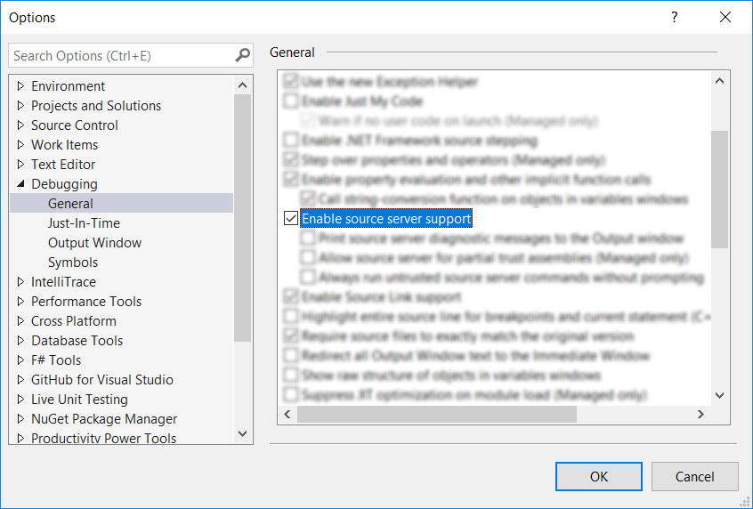

As of version 3.10, the NUnit and NUnitLite NuGet packages contain a source-indexed PDB for each binary from the source repository. Debuggers can step into the source code, set breakpoints, watch variables, etc. It’s easy to drop into NUnit code any time you want to understand what’s going on.

If you’re getting ready to report a bug in NUnit, figuring out how to create a minimal repro is much easier since you aren’t dealing with a black box!

## How to step into NUnit source in the Visual Studio debugger

The NUnit framework PDBs are source-indexed with [GitLink](https://github.com/GitTools/GitLink#gitlink) and work with Visual Studio 2005 or later.

 1. Turn **off** Debug > Options > ‘Enable Just My Code.’

    ℹ️ This is something you’ll want to leave on and only turn off when you want to step into source that isn’t contained in your solution.

    

    (Next time you can make this faster by installing the excellent extension
    [Just My Code Toggle](https://marketplace.visualstudio.com/items?itemName=SamHarwell.JustMyCodeToggle).
    This allows you to set a keyboard shortcut along with adding a toolbar button and call stack context menu item.)

 2. If needed, turn **on** Debug > Options > ‘Enable source server support.’ This can usually be left on.

    

 3. Make sure your project has `nunit.framework.pdb` copied to the output directory beside `nunit.framework.dll`. If you are **not** using the new-SDK .csproj format, you can probably skip this section.

    If it is missing, and you’re in the middle of debugging, simply copy it to the output directory from `%userprofile%\.nuget\packages\nunit\{version}\lib\{target}` and continue debugging. (If you’re using `packages.config`, it will be in the solution `packages` folder instead.)

    When your debugging session is finished, for a longer-term solution that won’t have to be repeated on cleans or package upgrades, paste this into a [`Directory.Build.props`](https://docs.microsoft.com/en-us/visualstudio/msbuild/customize-your-build#directorybuildprops-example) or your own `Common.props` or into the .csprojs from which you are debugging:

    ```xml
      <!-- https://github.com/dotnet/sdk/issues/1458 -->
      <PropertyGroup>
        <AllowedReferenceRelatedFileExtensions>.pdb</AllowedReferenceRelatedFileExtensions>
      </PropertyGroup>
      <Target Name="AddReferenceRelatedPathsToCopyLocal" AfterTargets="ResolveAssemblyReferences">
        <ItemGroup>
          <ReferenceCopyLocalPaths Include="@(_ReferenceRelatedPaths)" />
        </ItemGroup>
      </Target>
    ```

    And track the [issue](https://github.com/dotnet/sdk/issues/1458) linked in the comment to know when this workaround will no longer be needed.

 4. Congratulations! You can now use the debugger to step into method calls to NUnit and to set breakpoints and watch variables in NUnit source! Keep in mind that it’s still a release build of NUnit, so variables and sequence points may not be available depending on runtime optimizations.
